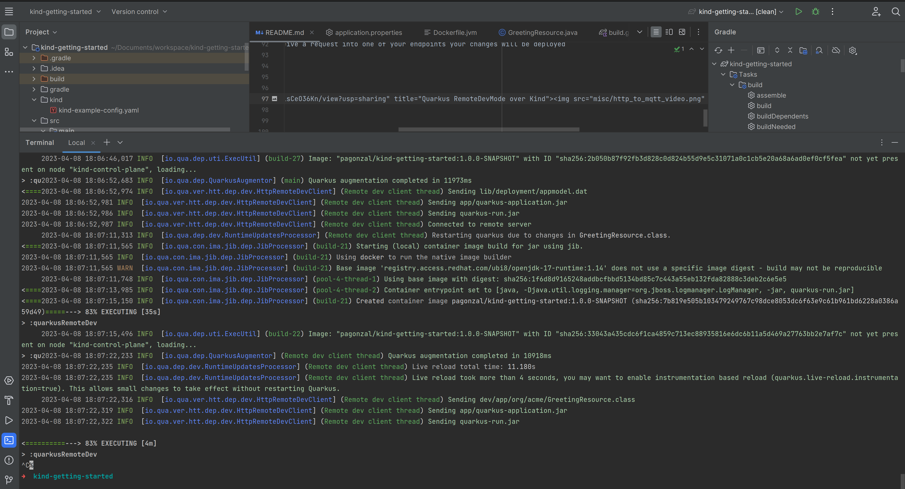

# RemoteDevMode example over Kind (k3s)

This project is an example of Quarkus remoteDevMode over [Kind](https://kind.sigs.k8s.io).
Basically Quarkus allows you to update your application code on the fly and do a hot deployment into Kubernetes

## Requirement

* Java17
* Docker
* kubectl
* Kind (K3s)
* golang
* Quarkus Cli (Optional)

## Install Kind (k3s)

Kind is a single kubernetes node, deployed as a docker instance. To install kind just compile the sources and moves the generated binary to `/usr/local/bin`

Install Kind commands example

compile kind
```shell
go install sigs.k8s.io/kind@v0.18.0
```

moves the generated bits to `/usr/local/bin`
```shell
mv ~/go/bin/kind /usr/local/bin/kind
```

double check that is installed: `kind --version`

In order to know more about how to install kind please take a look the official [documentation](https://kind.sigs.k8s.io/)

## Deploy Kind cluster

We are going to deploy our Quarkus app under a service that is exposed through a [nodePort](https://kind.sigs.k8s.io/docs/user/configuration/#nodeport-with-port-mappings)
so our cluster is going to be listening on port `8080` and pointing to `containerPort: 30771` as is described in Kind documentation

```shell
    extraPortMappings:
      - containerPort: 30771
        hostPort: 8080
        protocol: TCP
```

The full kind cluster custom config are located under [kind/kind-example-config.yaml](kind/kind-example-config.yaml)


### Launch Kind Cluster
```shell
kind create cluster --config kind/kind-example-config.yaml
```

### Verify Cluster settings

```shell
kubectl cluster-info --context kind-kind
```

## Quarkus required configuration

In order to `run / hotDeploy` our application into a `Kind` cluster we will need to deploy Quarkus as a `mutable-jar` using docker [Jib](https://quarkus.io/guides/container-image#jib)
plus some other required configuration, as environment `QUARKUS_LAUNCH_DEVMODE=true` or `quarkus.live-reload.password`. 

Everything is well explained on the official [site](https://quarkus.io/guides/maven-tooling#remote-development-mode).

RemoteDevMode `application.properties` example:

```shell
# Required by remoteDevMode
quarkus.package.type=mutable-jar
quarkus.live-reload.password=changeit
quarkus.jib.environment-variables.QUARKUS_LAUNCH_DEVMODE=true
```

The rest of the configuration are not remarkable in my opinion
```shell
quarkus.container-image.build=true
quarkus.kubernetes.deploy=true
quarkus.kubernetes.namespace=default
quarkus.kubernetes.node-port=30771
```
We are using the fixed nodePort that we set previously. 

## Run Quarkus in remoteDevMode

1. Compile your app `gradle clean build`

2. Run your app in remote devMode `gradle quarkusRemoteDev -Dquarkus.live-reload.instrumentation=true -Dquarkus.live-reload.url=http://localhost:8080`

3. Verify that you see something like this into your logs
```shell
> :qu2023-04-08 17:41:20,974 INFO  [io.qua.dep.QuarkusAugmentor] (main) Quarkus augmentation completed in 11684ms
<====2023-04-08 17:41:21,319 INFO  [io.qua.ver.htt.dep.dev.HttpRemoteDevClient] (Remote dev client thread) Sending lib/deployment/appmodel.dat
2023-04-08 17:41:21,326 INFO  [io.qua.ver.htt.dep.dev.HttpRemoteDevClient] (Remote dev client thread) Sending app/quarkus-application.jar
2023-04-08 17:41:21,329 INFO  [io.qua.ver.htt.dep.dev.HttpRemoteDevClient] (Remote dev client thread) Sending quarkus-run.jar
2023-04-08 17:41:21,330 INFO  [io.qua.ver.htt.dep.dev.HttpRemoteDevClient] (Remote dev client thread) Connected to remote server
```

Now you can start making changes into your code and will be re-deployed after receive a request.

## Demo

<a href="https://drive.google.com/file/d/1PWdJSS5E-Gy8Q1ofO1fW3lKisCeO36Kn/view?usp=sharing" title="Quarkus RemoteDevMode over Kind"></a>

## Delete kind cluster

`kind delete cluster`
